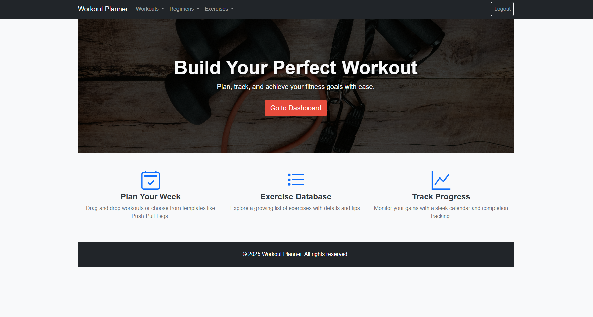
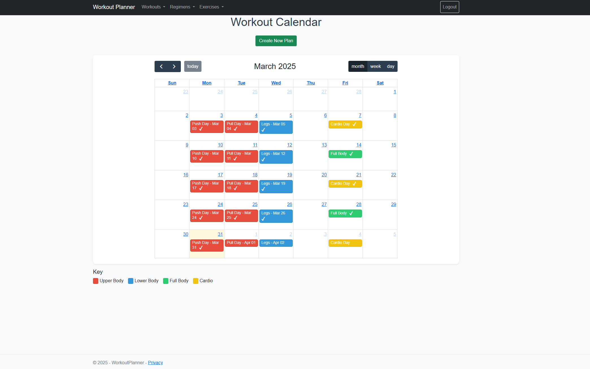
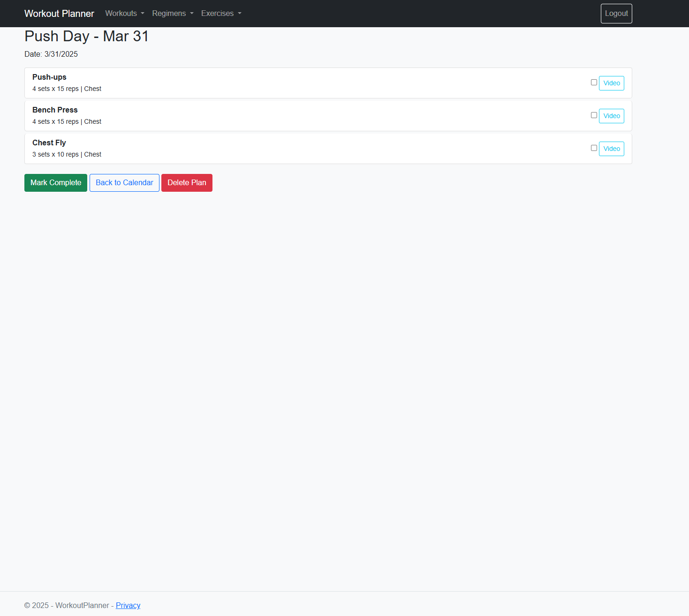

# WorkoutPlanner

A modern fitness app to plan, track, and achieve workout goals with an intuitive interface and robust backend.

## Features
- **Interactive Calendar**: Drag-and-drop workouts with completion checkmarks for a visual progress overview.
- **Progress Tracking**: Mark workouts complete with duplicate prevention, stored securely in a database.
- **Exercise Database**: Browse and integrate exercise templates (e.g., reps, sets, videos) into plans.
- **User Authentication**: Secure login and personalized data via ASP.NET Identity.

## Tech Stack
- **Backend**: ASP.NET Core MVC, Entity Framework Core, SQLite
- **Frontend**: Bootstrap 5, FullCalendar 6, JavaScript (fetch API)
- **Styling**: Custom CSS for a responsive, polished design

## Setup
1. **Clone**: `git clone [your-repo-url]`
2. **Restore**: `dotnet restore`
3. **Database**: Update `appsettings.json` with your SQLite connection string (default: `Data Source=app.db`).
4. **Run**: `dotnet run` (or `dotnet run --configuration Release` for production).
5. **Access**: Open `https://localhost:7225` in your browser.

## Screenshots
- **Homepage**: Clean landing page with clickable features  
  
- **Calendar**: Interactive workout scheduling with completion indicators  
  
- **Details**: Detailed workout view with progress tracking  
  

## About
Created by Eden Piatnichko as a showcase of full-stack web development skills.  
- LinkedIn: www.linkedin.com/in/eden-piatnichko-14a020176
- GitHub: https://github.com/Edenova

Feedback welcome�happy lifting!